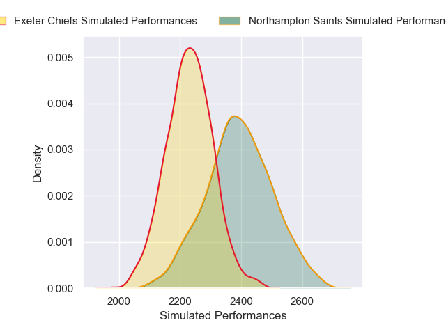
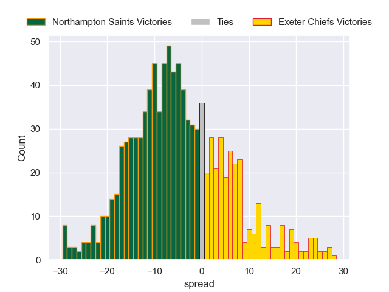

---  
layout: page  
title: Northampton Saints V Exeter Chiefs on 2025/09/28  
date: 2025-09-28  
categories: "Gallagher Premiership 25/26" match projection  
---
# Northampton Saints V Exeter Chiefs on 2025/09/28, 33.0 to 33.0

# Club Level Predictions

Now that the game has been played, lets see how the club predictions did. I predicted Northampton Saints to win by 3.76, and Exeter Chiefs won by 0.0. That's an absolute error of 3.8 for the margin of victory, while my average absolute error has been 14.6 over the past six months. This prediction was more accurate than 82.7% of my recent predictions.

For the Over/Under model, I predicted a total of 53.5 and we have an actual total of 66.0. That's an absolute error of 12.5 compared to a six month average of 13.7. This prediction was more accurate than 45.3% of my recent predictions.
## Projected Performances - Club Model

## Projected Spreads - Club Model

## Projected Results - Club Model

