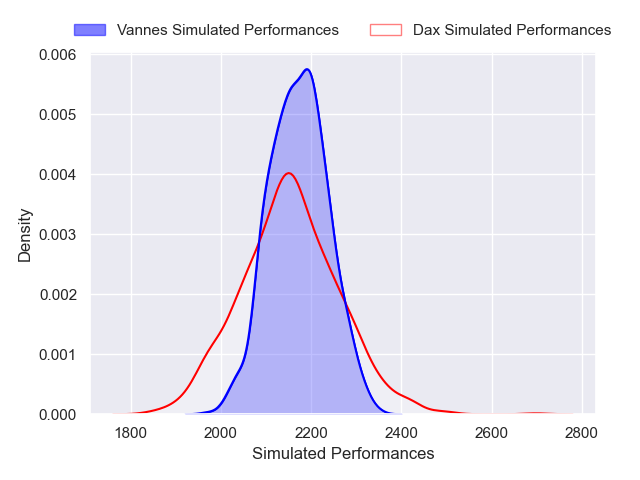

---  
layout: page  
title: Dax V Vannes on 2025/10/02  
date: 2025-10-02  
categories: "Pro D2 25/26" match projection  
---
# Dax V Vannes on 2025/10/02, 15.0 to 16.0

# Club Level Predictions

Now that the game has been played, lets see how the club predictions did. I predicted Vannes to win by 2.35, and Vannes won by 1.0. That's an absolute error of 1.4 for the margin of victory, while my average absolute error has been 16.6 over the past six months. This prediction was more accurate than 95.4% of my recent predictions.

For the Over/Under model, I predicted a total of 49.5 and we have an actual total of 31.0. That's an absolute error of 18.5 compared to a six month average of 13.7. This prediction was more accurate than 27.3% of my recent predictions.
## Projected Performances - Club Model

## Projected Spreads - Club Model

## Projected Results - Club Model

