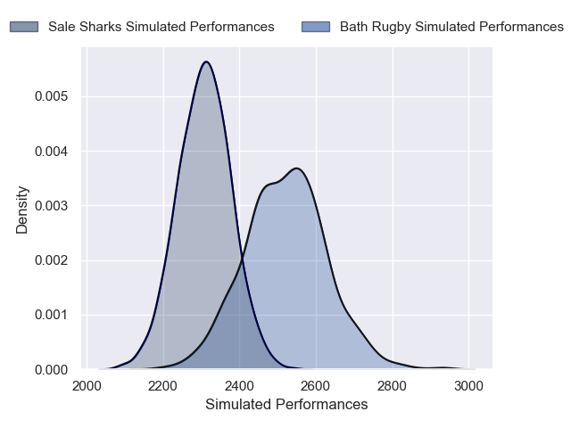
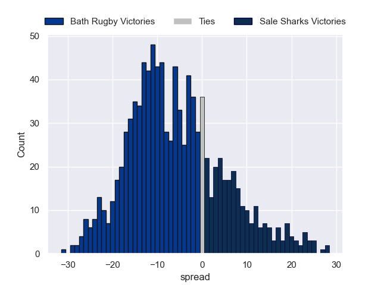

---  
layout: page  
title: Bath Rugby V Sale Sharks on 2025/10/03  
date: 2025-10-03  
categories: "Gallagher Premiership 25/26" match projection  
---
# Bath Rugby V Sale Sharks on 2025/10/03, 28.0 to 16.0

# Club Level Predictions

Now that the game has been played, lets see how the club predictions did. I predicted Bath Rugby to win by 5.15, and Bath Rugby won by 12.0. That's an absolute error of 6.8 for the margin of victory, while my average absolute error has been 14.2 over the past six months. This prediction was more accurate than 67.3% of my recent predictions.

For the Over/Under model, I predicted a total of 49.5 and we have an actual total of 44.0. That's an absolute error of 5.5 compared to a six month average of 13.7. This prediction was more accurate than 74.8% of my recent predictions.
## Projected Performances - Club Model

## Projected Spreads - Club Model

## Projected Results - Club Model

