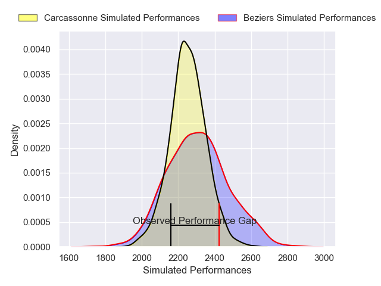
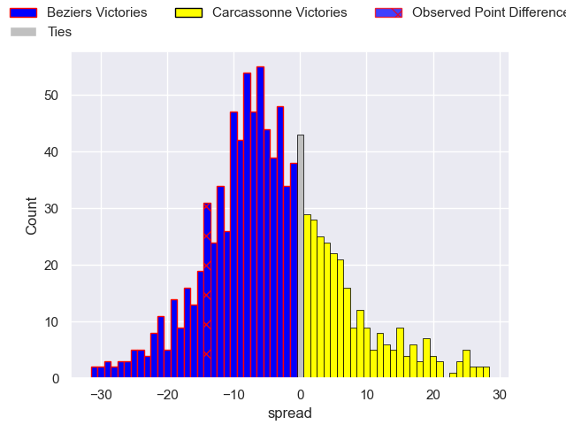
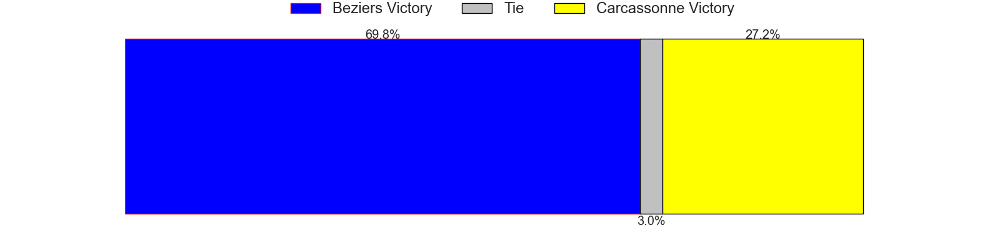

---  
layout: page  
title: Beziers V Carcassonne on 2025/10/03  
date: 2025-10-03  
categories: "Pro D2 25/26" match projection  
---
# Beziers V Carcassonne on 2025/10/03, 14.0 to 0.0

# Club Level Predictions

Now that the game has been played, lets see how the club predictions did. I predicted Beziers to win by 4.28, and Beziers won by 14.0. That's an absolute error of 9.7 for the margin of victory, while my average absolute error has been 14.5 over the past six months. This prediction was more accurate than 53.9% of my recent predictions.

For the Over/Under model, I predicted a total of 44.5 and we have an actual total of 14.0. That's an absolute error of 30.5 compared to a six month average of 13.8. This prediction was more accurate than 8.4% of my recent predictions.
## Projected Performances - Club Model

## Projected Spreads - Club Model

## Projected Results - Club Model

