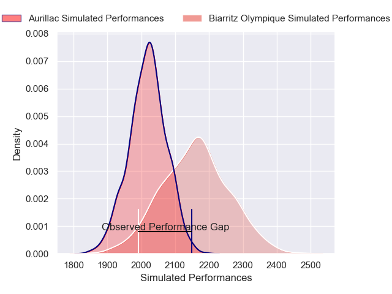
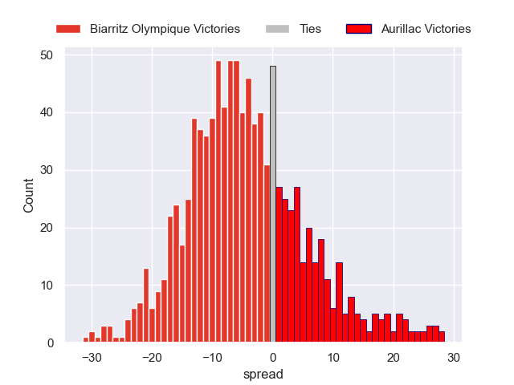
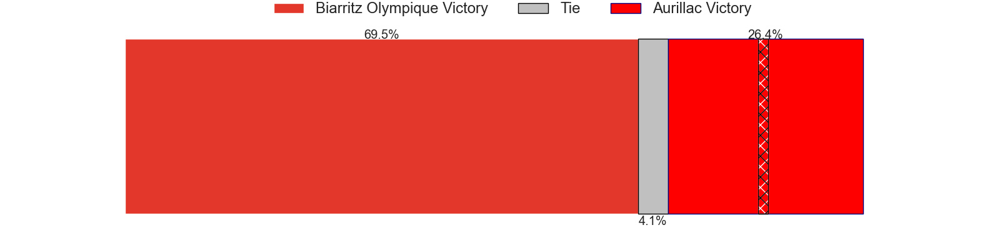

---  
layout: page  
title: Biarritz Olympique V Aurillac on 2025/10/03  
date: 2025-10-03  
categories: "Pro D2 25/26" match projection  
---
# Biarritz Olympique V Aurillac on 2025/10/03, 13.0 to 19.0

# Club Level Predictions

Now that the game has been played, lets see how the club predictions did. I predicted Biarritz Olympique to win by 4.0, and Aurillac won by 6.0. That's an absolute error of 10.0 for the margin of victory, while my average absolute error has been 14.4 over the past six months. This prediction was more accurate than 52.0% of my recent predictions.

For the Over/Under model, I predicted a total of 50.5 and we have an actual total of 32.0. That's an absolute error of 18.5 compared to a six month average of 14.3. This prediction was more accurate than 28.8% of my recent predictions.
## Projected Performances - Club Model

## Projected Spreads - Club Model

## Projected Results - Club Model

