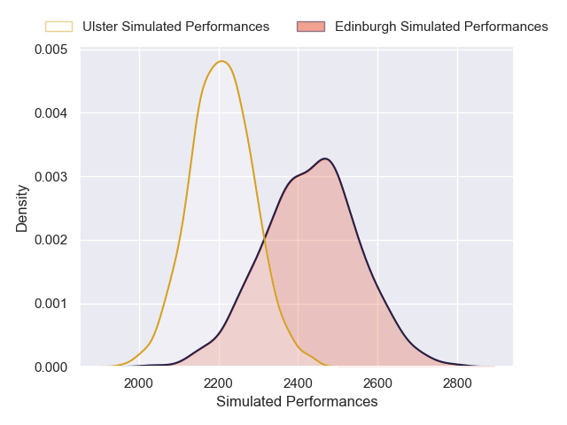
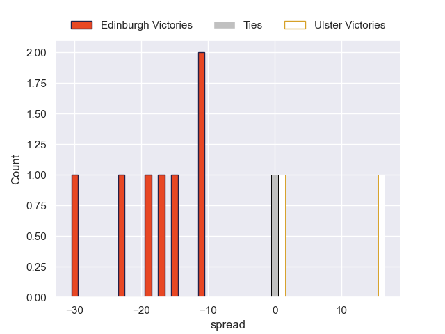

---  
layout: page  
title: Edinburgh V Ulster on 2025/10/03  
date: 2025-10-03  
categories: "United Rugby Championship 25/26" match projection  
---
# Edinburgh V Ulster on 2025/10/03, 0.0 to 0.0

# Club Level Predictions

Now that the game has been played, lets see how the club predictions did. I predicted Edinburgh to win by 5.25, and Ulster won by 0.0. That's an absolute error of 5.2 for the margin of victory, while my average absolute error has been 14.4 over the past six months. This prediction was more accurate than 74.9% of my recent predictions.

For the Over/Under model, I predicted a total of 58.5 and we have an actual total of 0.0. That's an absolute error of 58.5 compared to a six month average of 14.3. This prediction was more accurate than 0.2% of my recent predictions.
## Projected Performances - Club Model

## Projected Spreads - Club Model

## Projected Results - Club Model

