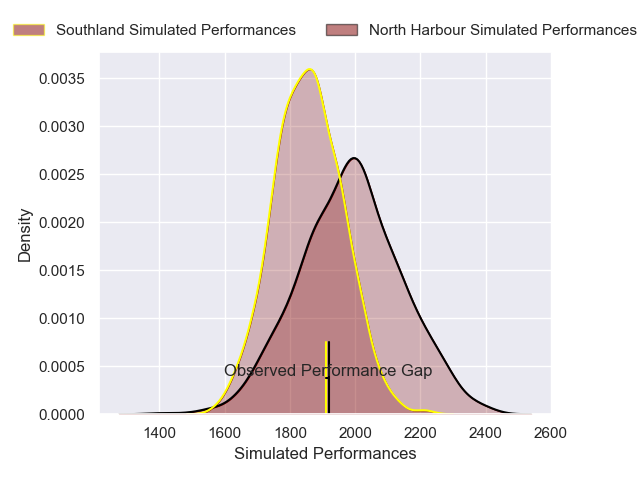
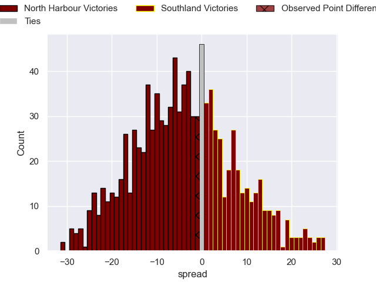

---  
layout: page  
title: North Harbour V Southland on 2025/10/03  
date: 2025-10-03  
categories: "NPC 2025" match projection  
---
# North Harbour V Southland on 2025/10/03, 15.0 to 14.0

# Club Level Predictions

Now that the game has been played, lets see how the club predictions did. I predicted North Harbour to win by 6.02, and North Harbour won by 1.0. That's an absolute error of 5.0 for the margin of victory, while my average absolute error has been 16.6 over the past six months. This prediction was more accurate than 78.2% of my recent predictions.

For the Over/Under model, I predicted a total of 58.5 and we have an actual total of 29.0. That's an absolute error of 29.5 compared to a six month average of 13.7. This prediction was more accurate than 9.1% of my recent predictions.
## Projected Performances - Club Model

## Projected Spreads - Club Model

## Projected Results - Club Model

