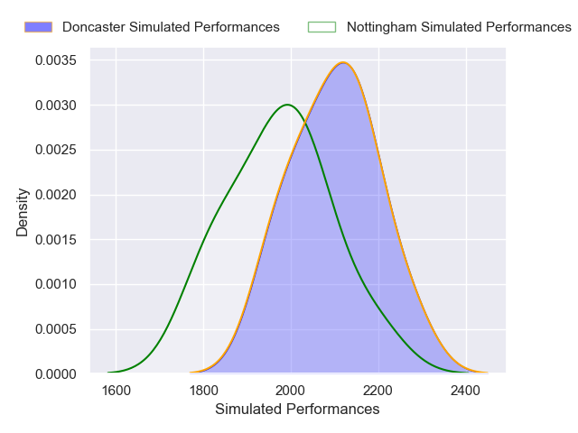
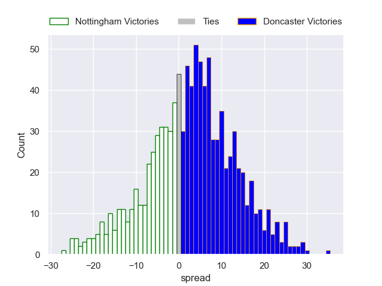

---  
layout: page  
title: Nottingham V Doncaster on 2025/10/03  
date: 2025-10-03  
categories: "RFU Championship 25/26" match projection  
---
# Nottingham V Doncaster on 2025/10/03, 26.0 to 8.0

# Club Level Predictions

Now that the game has been played, lets see how the club predictions did. I predicted Doncaster to win by 2.65, and Nottingham won by 18.0. That's an absolute error of 20.6 for the margin of victory, while my average absolute error has been 14.4 over the past six months. This prediction was more accurate than 23.0% of my recent predictions.

For the Over/Under model, I predicted a total of 65.5 and we have an actual total of 34.0. That's an absolute error of 31.5 compared to a six month average of 14.3. This prediction was more accurate than 7.9% of my recent predictions.
## Projected Performances - Club Model

## Projected Spreads - Club Model

## Projected Results - Club Model

