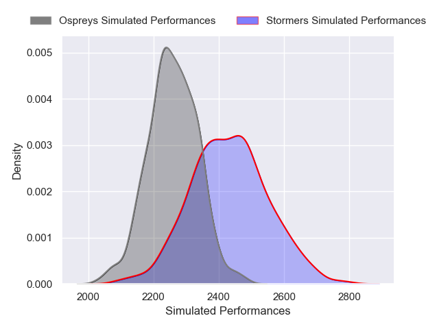
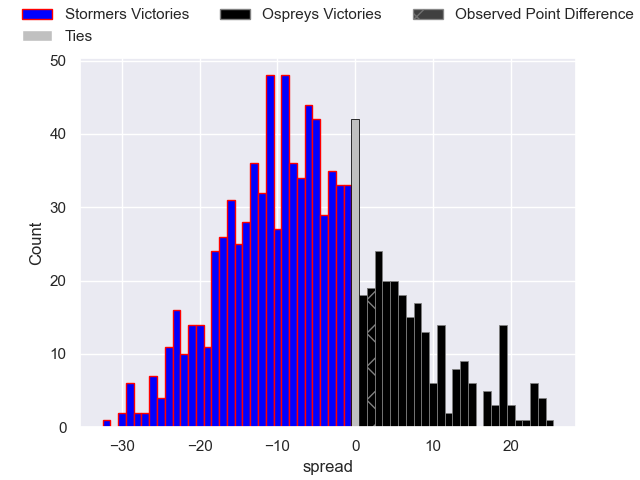

---  
layout: page  
title: Stormers V Ospreys on 2025/10/03  
date: 2025-10-03  
categories: "United Rugby Championship 25/26" match projection  
---
# Stormers V Ospreys on 2025/10/03, 8.0 to 10.0

# Club Level Predictions

Now that the game has been played, lets see how the club predictions did. I predicted Stormers to win by 5.73, and Ospreys won by 2.0. That's an absolute error of 7.7 for the margin of victory, while my average absolute error has been 14.5 over the past six months. This prediction was more accurate than 63.5% of my recent predictions.

For the Over/Under model, I predicted a total of 51.5 and we have an actual total of 18.0. That's an absolute error of 33.5 compared to a six month average of 13.8. This prediction was more accurate than 5.6% of my recent predictions.
## Projected Performances - Club Model

## Projected Spreads - Club Model

## Projected Results - Club Model

