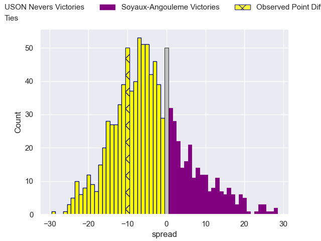
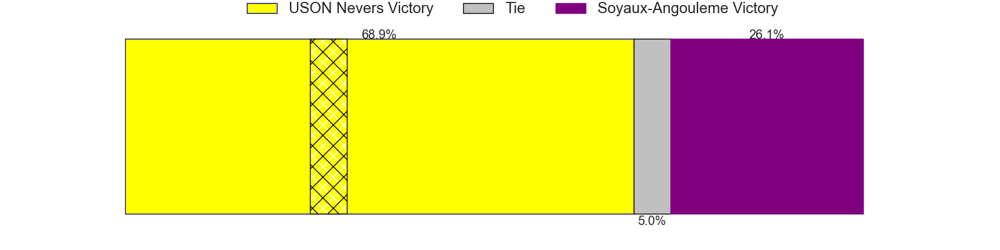

---  
layout: page  
title: USON Nevers V Soyaux-Angouleme on 2025/10/03  
date: 2025-10-03  
categories: "Pro D2 25/26" match projection  
---
# USON Nevers V Soyaux-Angouleme on 2025/10/03, 33.0 to 10.0

# Club Level Predictions

Now that the game has been played, lets see how the club predictions did. I predicted USON Nevers to win by 3.85, and USON Nevers won by 23.0. That's an absolute error of 19.2 for the margin of victory, while my average absolute error has been 14.4 over the past six months. This prediction was more accurate than 27.5% of my recent predictions.

For the Over/Under model, I predicted a total of 50.5 and we have an actual total of 43.0. That's an absolute error of 7.5 compared to a six month average of 14.3. This prediction was more accurate than 67.0% of my recent predictions.
## Projected Performances - Club Model

## Projected Spreads - Club Model

## Projected Results - Club Model

