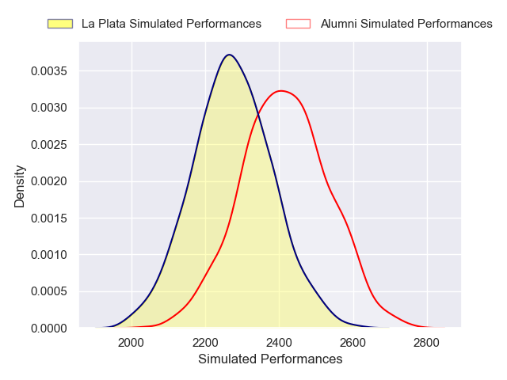
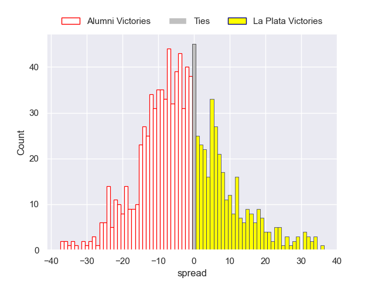
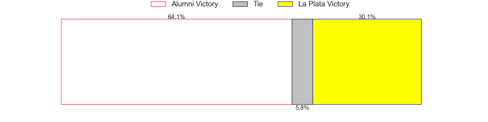

---  
layout: page  
title: Alumni V La Plata on 2025/10/04  
date: 2025-10-04  
categories: "URBA Top 13 2025" match projection  
---
# Alumni V La Plata on 2025/10/04, 50.0 to 19.0

# Club Level Predictions

Now that the game has been played, lets see how the club predictions did. I predicted Alumni to win by 4.61, and Alumni won by 31.0. That's an absolute error of 26.4 for the margin of victory, while my average absolute error has been 14.2 over the past six months. This prediction was more accurate than 14.2% of my recent predictions.

For the Over/Under model, I predicted a total of 48.5 and we have an actual total of 69.0. That's an absolute error of 20.5 compared to a six month average of 13.7. This prediction was more accurate than 22.5% of my recent predictions.
## Projected Performances - Club Model

## Projected Spreads - Club Model

## Projected Results - Club Model

