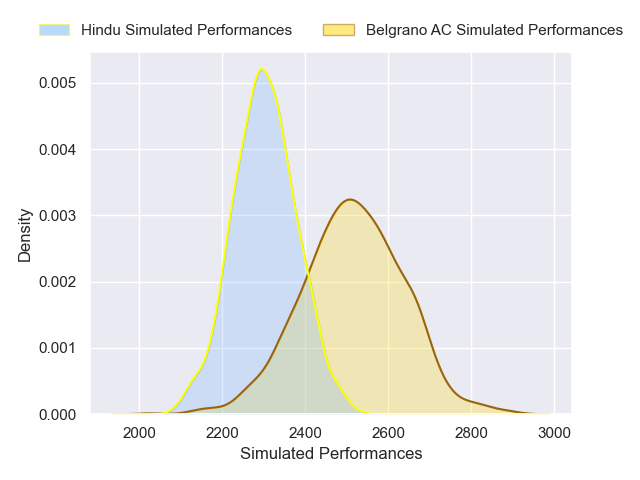
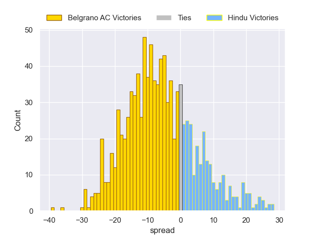

---  
layout: page  
title: Belgrano AC V Hindu on 2025/10/04  
date: 2025-10-04  
categories: "URBA Top 13 2025" match projection  
---
# Belgrano AC V Hindu on 2025/10/04, 43.0 to 27.0

# Club Level Predictions

Now that the game has been played, lets see how the club predictions did. I predicted Belgrano AC to win by 5.85, and Belgrano AC won by 16.0. That's an absolute error of 10.2 for the margin of victory, while my average absolute error has been 14.2 over the past six months. This prediction was more accurate than 51.1% of my recent predictions.

For the Over/Under model, I predicted a total of 51.5 and we have an actual total of 70.0. That's an absolute error of 18.5 compared to a six month average of 13.7. This prediction was more accurate than 26.9% of my recent predictions.
## Projected Performances - Club Model

## Projected Spreads - Club Model

## Projected Results - Club Model

