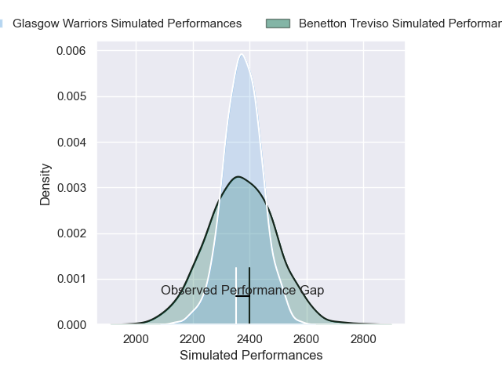
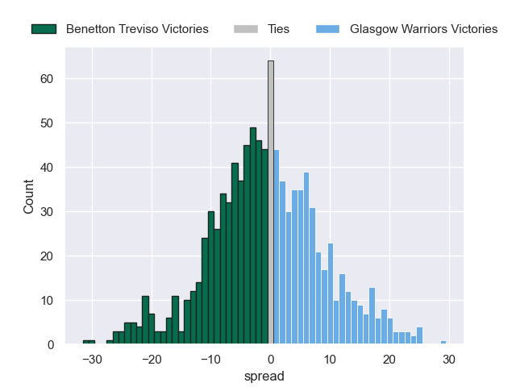
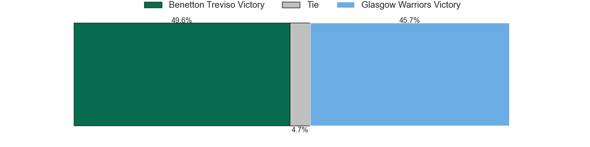

---  
layout: page  
title: Benetton Treviso V Glasgow Warriors on 2025/10/04  
date: 2025-10-04  
categories: "United Rugby Championship 25/26" match projection  
---
# Benetton Treviso V Glasgow Warriors on 2025/10/04, 16.0 to 14.0

# Club Level Predictions

Now that the game has been played, lets see how the club predictions did. I predicted Benetton Treviso to win by 0.07, and Benetton Treviso won by 2.0. That's an absolute error of 1.9 for the margin of victory, while my average absolute error has been 14.2 over the past six months. This prediction was more accurate than 91.0% of my recent predictions.

For the Over/Under model, I predicted a total of 47.5 and we have an actual total of 30.0. That's an absolute error of 17.5 compared to a six month average of 13.7. This prediction was more accurate than 29.6% of my recent predictions.
## Projected Performances - Club Model

## Projected Spreads - Club Model

## Projected Results - Club Model

