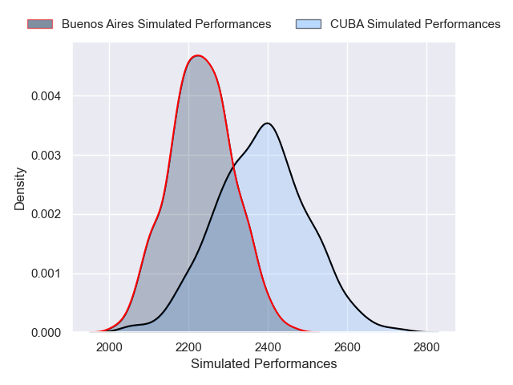
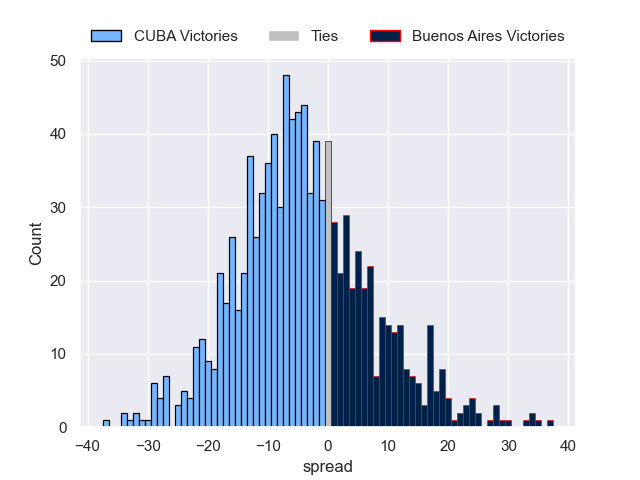

---  
layout: page  
title: CUBA V Buenos Aires on 2025/10/04  
date: 2025-10-04  
categories: "URBA Top 13 2025" match projection  
---
# CUBA V Buenos Aires on 2025/10/04, 42.0 to 23.0

# Club Level Predictions

Now that the game has been played, lets see how the club predictions did. I predicted CUBA to win by 5.61, and CUBA won by 19.0. That's an absolute error of 13.4 for the margin of victory, while my average absolute error has been 14.2 over the past six months. This prediction was more accurate than 39.1% of my recent predictions.

For the Over/Under model, I predicted a total of 50.5 and we have an actual total of 65.0. That's an absolute error of 14.5 compared to a six month average of 13.7. This prediction was more accurate than 38.6% of my recent predictions.
## Projected Performances - Club Model

## Projected Spreads - Club Model

## Projected Results - Club Model

