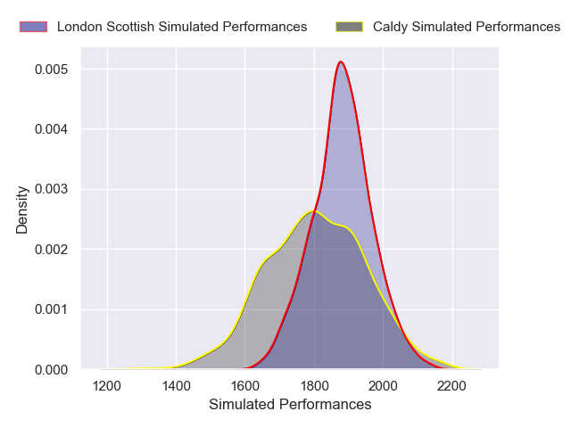
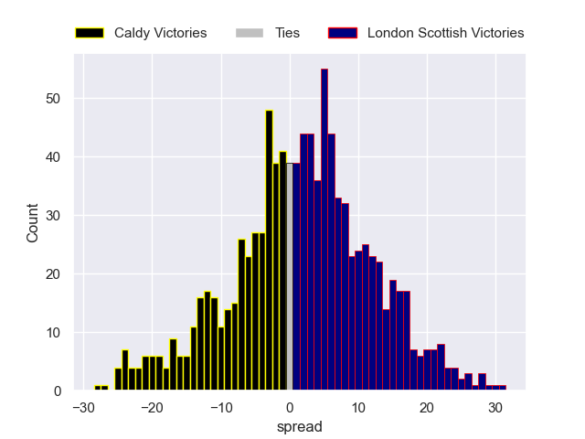

---  
layout: page  
title: Caldy V London Scottish on 2025/10/04  
date: 2025-10-04  
categories: "RFU Championship 25/26" match projection  
---
# Caldy V London Scottish on 2025/10/04, 26.0 to 10.0

# Club Level Predictions

Now that the game has been played, lets see how the club predictions did. I predicted London Scottish to win by 2.52, and Caldy won by 16.0. That's an absolute error of 18.5 for the margin of victory, while my average absolute error has been 14.4 over the past six months. This prediction was more accurate than 28.7% of my recent predictions.

For the Over/Under model, I predicted a total of 65.5 and we have an actual total of 36.0. That's an absolute error of 29.5 compared to a six month average of 14.3. This prediction was more accurate than 10.0% of my recent predictions.
## Projected Performances - Club Model

## Projected Spreads - Club Model

## Projected Results - Club Model

