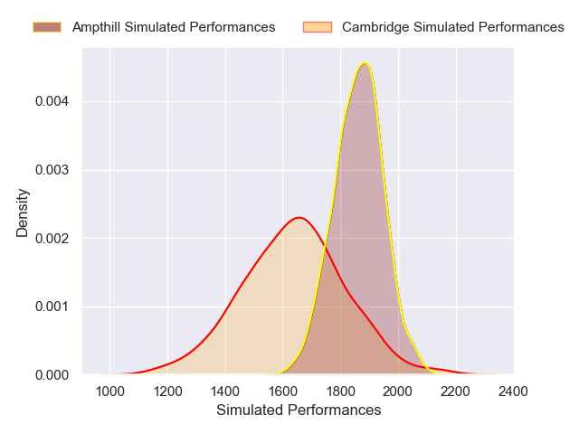
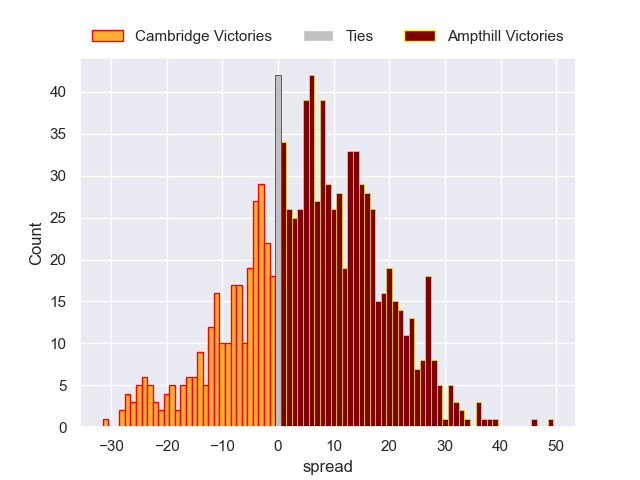

---  
layout: page  
title: Cambridge V Ampthill on 2025/10/04  
date: 2025-10-04  
categories: "RFU Championship 25/26" match projection  
---
# Cambridge V Ampthill on 2025/10/04, 24.0 to 45.0

# Club Level Predictions

Now that the game has been played, lets see how the club predictions did. I predicted Ampthill to win by 7.75, and Ampthill won by 21.0. That's an absolute error of 13.2 for the margin of victory, while my average absolute error has been 16.6 over the past six months. This prediction was more accurate than 47.3% of my recent predictions.

For the Over/Under model, I predicted a total of 88.5 and we have an actual total of 69.0. That's an absolute error of 19.5 compared to a six month average of 13.7. This prediction was more accurate than 24.1% of my recent predictions.
## Projected Performances - Club Model

## Projected Spreads - Club Model

## Projected Results - Club Model

