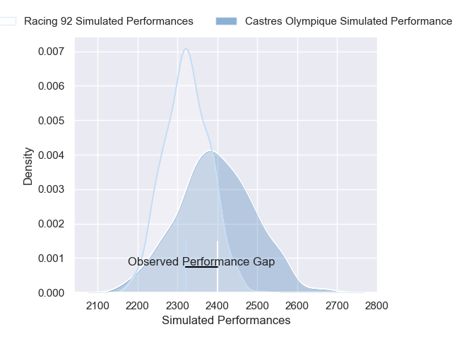
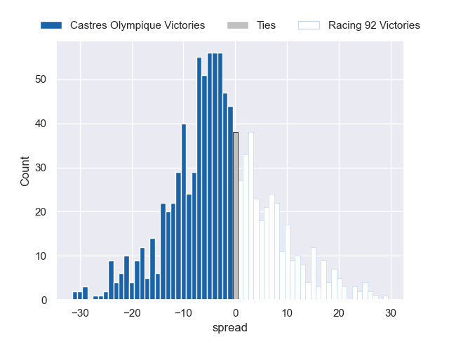

---  
layout: page  
title: Castres Olympique V Racing 92 on 2025/10/04  
date: 2025-10-04  
categories: "Top 14 25/26" match projection  
---
# Castres Olympique V Racing 92 on 2025/10/04, 20.0 to 16.0

# Club Level Predictions

Now that the game has been played, lets see how the club predictions did. I predicted Castres Olympique to win by 2.52, and Castres Olympique won by 4.0. That's an absolute error of 1.5 for the margin of victory, while my average absolute error has been 14.4 over the past six months. This prediction was more accurate than 92.8% of my recent predictions.

For the Over/Under model, I predicted a total of 58.5 and we have an actual total of 36.0. That's an absolute error of 22.5 compared to a six month average of 14.3. This prediction was more accurate than 20.0% of my recent predictions.
## Projected Performances - Club Model

## Projected Spreads - Club Model

## Projected Results - Club Model

