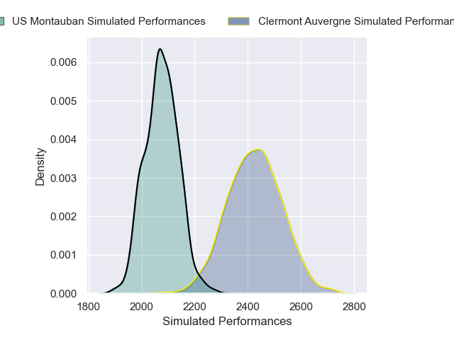
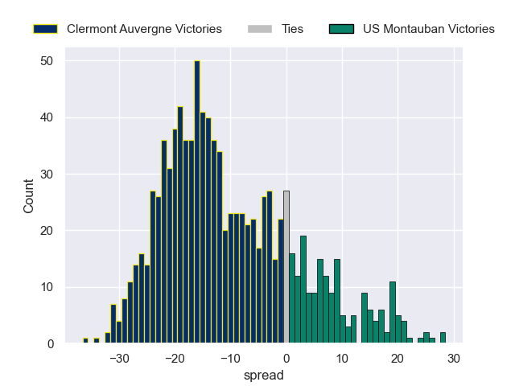
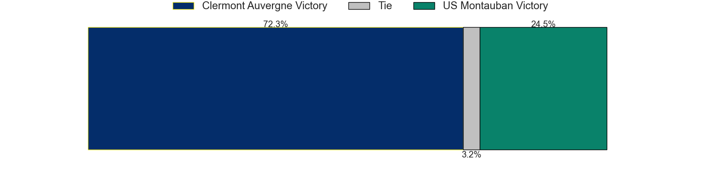

---  
layout: page  
title: Clermont Auvergne V US Montauban on 2025/10/04  
date: 2025-10-04  
categories: "Top 14 25/26" match projection  
---
# Clermont Auvergne V US Montauban on 2025/10/04, 84.0 to 31.0

# Club Level Predictions

Now that the game has been played, lets see how the club predictions did. I predicted Clermont Auvergne to win by 9.15, and Clermont Auvergne won by 53.0. That's an absolute error of 43.8 for the margin of victory, while my average absolute error has been 14.2 over the past six months. This prediction was more accurate than 3.5% of my recent predictions.

For the Over/Under model, I predicted a total of 56.5 and we have an actual total of 115.0. That's an absolute error of 58.5 compared to a six month average of 13.7. This prediction was more accurate than 0.1% of my recent predictions.
## Projected Performances - Club Model

## Projected Spreads - Club Model

## Projected Results - Club Model

