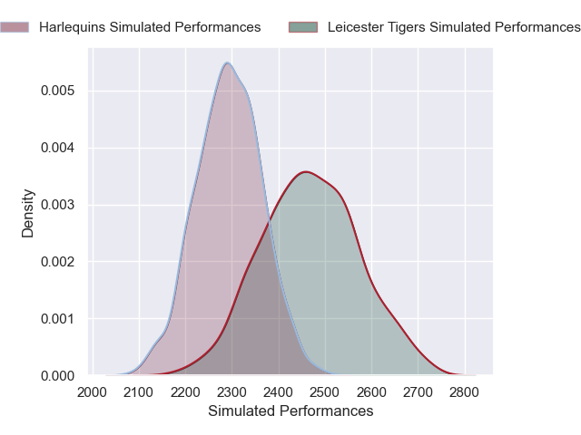
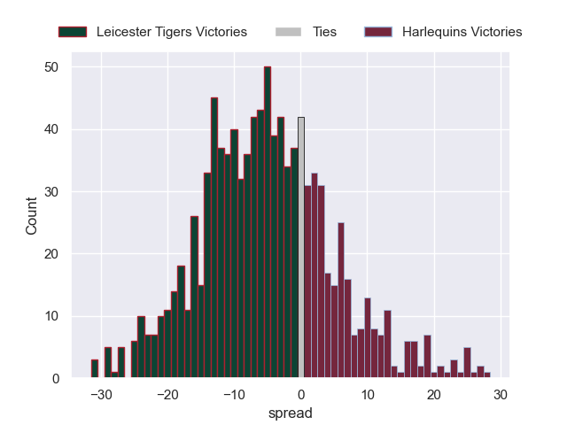

---  
layout: page  
title: Leicester Tigers V Harlequins on 2025/10/04  
date: 2025-10-04  
categories: "Gallagher Premiership 25/26" match projection  
---
# Leicester Tigers V Harlequins on 2025/10/04, 29.0 to 19.0

# Club Level Predictions

Now that the game has been played, lets see how the club predictions did. I predicted Leicester Tigers to win by 9.79, and Leicester Tigers won by 10.0. That's an absolute error of 0.2 for the margin of victory, while my average absolute error has been 16.6 over the past six months. This prediction was more accurate than 99.6% of my recent predictions.

For the Over/Under model, I predicted a total of 55.5 and we have an actual total of 48.0. That's an absolute error of 7.5 compared to a six month average of 13.7. This prediction was more accurate than 66.8% of my recent predictions.
## Projected Performances - Club Model

## Projected Spreads - Club Model

## Projected Results - Club Model

