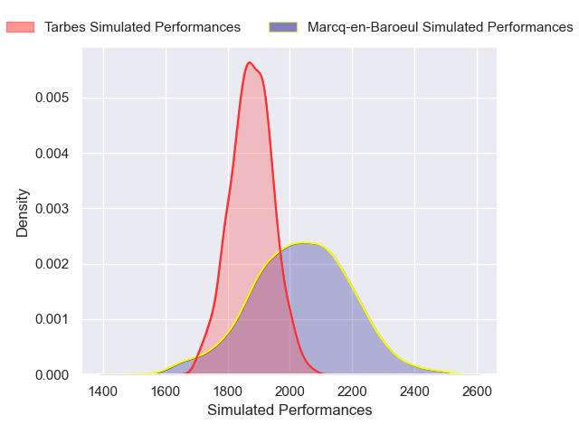
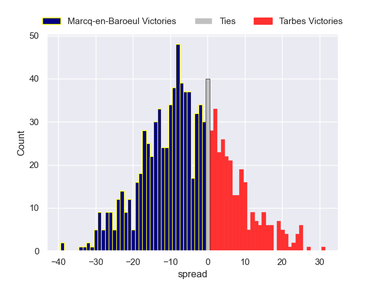

---  
layout: page  
title: Marcq-en-Baroeul V Tarbes on 2025/10/04  
date: 2025-10-04  
categories: "Nationale 25/26" match projection  
---
# Marcq-en-Baroeul V Tarbes on 2025/10/04, 28.0 to 16.0

# Club Level Predictions

Now that the game has been played, lets see how the club predictions did. I predicted Marcq-en-Baroeul to win by 3.74, and Marcq-en-Baroeul won by 12.0. That's an absolute error of 8.3 for the margin of victory, while my average absolute error has been 14.2 over the past six months. This prediction was more accurate than 59.8% of my recent predictions.

For the Over/Under model, I predicted a total of 40.5 and we have an actual total of 44.0. That's an absolute error of 3.5 compared to a six month average of 13.7. This prediction was more accurate than 83.9% of my recent predictions.
## Projected Performances - Club Model

## Projected Spreads - Club Model

## Projected Results - Club Model

