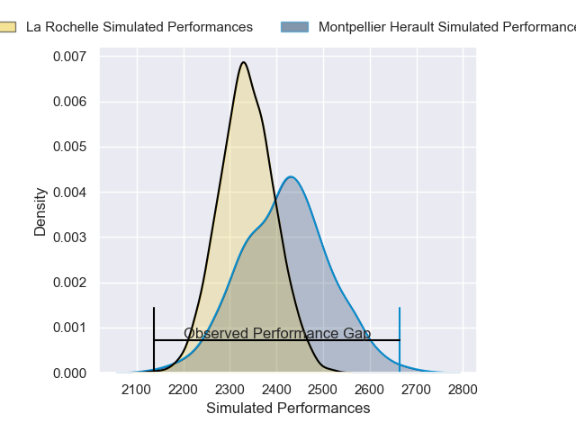
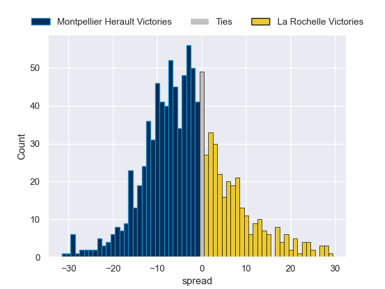

---  
layout: page  
title: Montpellier Herault V La Rochelle on 2025/10/04  
date: 2025-10-04  
categories: "Top 14 25/26" match projection  
---
# Montpellier Herault V La Rochelle on 2025/10/04, 37.0 to 13.0

# Club Level Predictions

Now that the game has been played, lets see how the club predictions did. I predicted Montpellier Herault to win by 2.75, and Montpellier Herault won by 24.0. That's an absolute error of 21.2 for the margin of victory, while my average absolute error has been 14.4 over the past six months. This prediction was more accurate than 22.2% of my recent predictions.

For the Over/Under model, I predicted a total of 52.5 and we have an actual total of 50.0. That's an absolute error of 2.5 compared to a six month average of 14.3. This prediction was more accurate than 87.9% of my recent predictions.
## Projected Performances - Club Model

## Projected Spreads - Club Model

## Projected Results - Club Model

