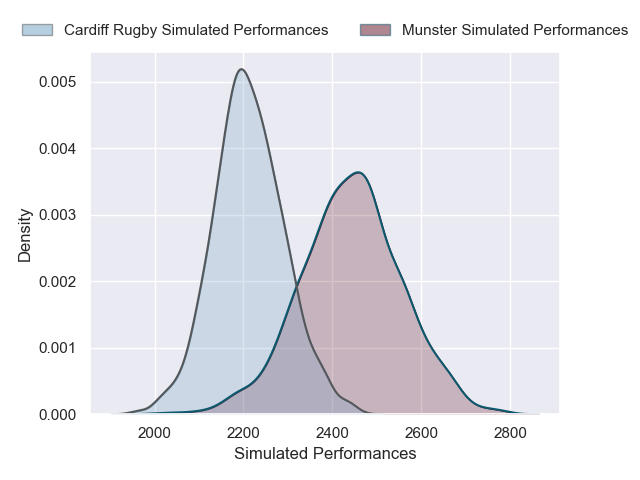
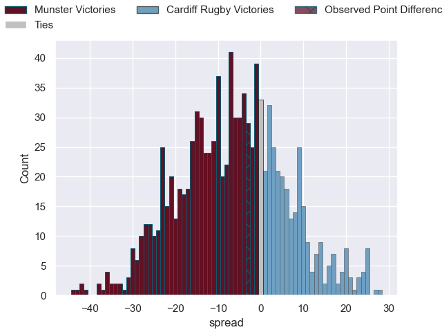

---  
layout: page  
title: Munster V Cardiff Rugby on 2025/10/04  
date: 2025-10-04  
categories: "United Rugby Championship 25/26" match projection  
---
# Munster V Cardiff Rugby on 2025/10/04, 23.0 to 20.0

# Club Level Predictions

Now that the game has been played, lets see how the club predictions did. I predicted Munster to win by 5.99, and Munster won by 3.0. That's an absolute error of 3.0 for the margin of victory, while my average absolute error has been 14.2 over the past six months. This prediction was more accurate than 86.4% of my recent predictions.

For the Over/Under model, I predicted a total of 47.5 and we have an actual total of 43.0. That's an absolute error of 4.5 compared to a six month average of 13.7. This prediction was more accurate than 79.5% of my recent predictions.
## Projected Performances - Club Model

## Projected Spreads - Club Model

## Projected Results - Club Model

