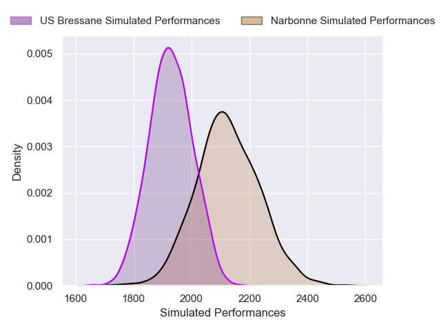
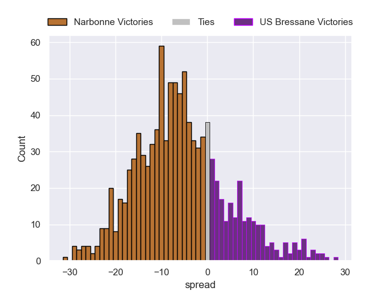
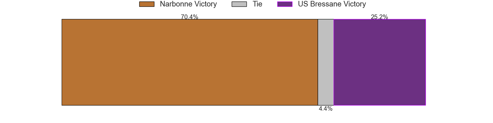

---  
layout: page  
title: Narbonne V US Bressane on 2025/10/04  
date: 2025-10-04  
categories: "Nationale 25/26" match projection  
---
# Narbonne V US Bressane on 2025/10/04, 43.0 to 6.0

# Club Level Predictions

Now that the game has been played, lets see how the club predictions did. I predicted Narbonne to win by 7.19, and Narbonne won by 37.0. That's an absolute error of 29.8 for the margin of victory, while my average absolute error has been 16.6 over the past six months. This prediction was more accurate than 15.3% of my recent predictions.

For the Over/Under model, I predicted a total of 43.5 and we have an actual total of 49.0. That's an absolute error of 5.5 compared to a six month average of 13.7. This prediction was more accurate than 75.0% of my recent predictions.
## Projected Performances - Club Model

## Projected Spreads - Club Model

## Projected Results - Club Model

