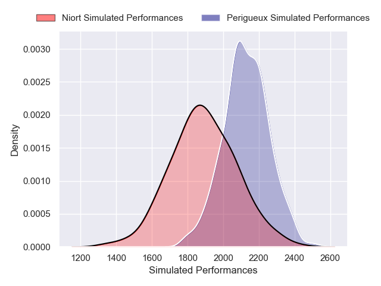
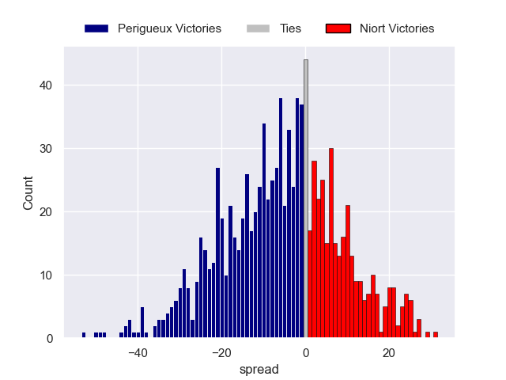

---  
layout: page  
title: Périgueux V Niort on 2025/10/04  
date: 2025-10-04  
categories: "Nationale 25/26" match projection  
---
# Périgueux V Niort on 2025/10/04, 24.0 to 23.0

# Club Level Predictions

Now that the game has been played, lets see how the club predictions did. I predicted Perigueux to win by 6.49, and Perigueux won by 1.0. That's an absolute error of 5.5 for the margin of victory, while my average absolute error has been 14.4 over the past six months. This prediction was more accurate than 73.7% of my recent predictions.

For the Over/Under model, I predicted a total of 48.5 and we have an actual total of 47.0. That's an absolute error of 1.5 compared to a six month average of 14.3. This prediction was more accurate than 92.4% of my recent predictions.
## Projected Performances - Club Model

## Projected Spreads - Club Model

## Projected Results - Club Model

