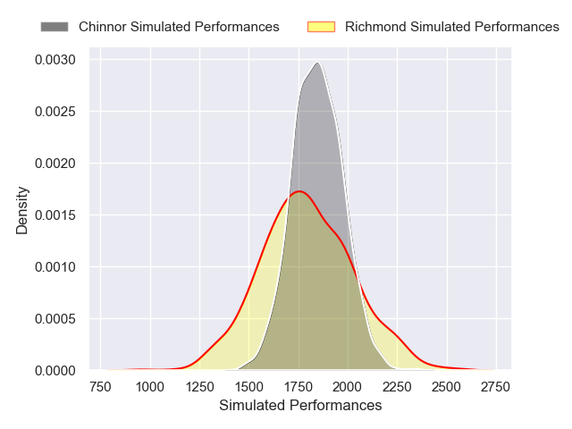
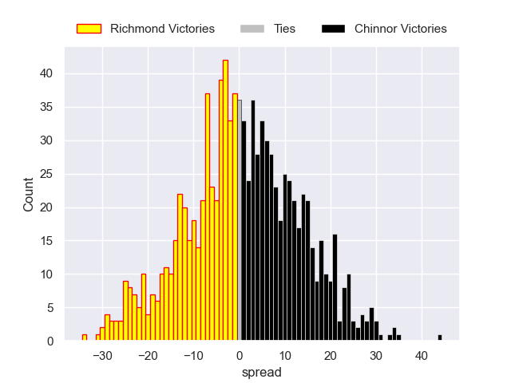

---  
layout: page  
title: Richmond V Chinnor on 2025/10/04  
date: 2025-10-04  
categories: "RFU Championship 25/26" match projection  
---
# Richmond V Chinnor on 2025/10/04, 18.0 to 13.0

# Club Level Predictions

Now that the game has been played, lets see how the club predictions did. I predicted Richmond to win by 12.16, and Richmond won by 5.0. That's an absolute error of 7.2 for the margin of victory, while my average absolute error has been 16.6 over the past six months. This prediction was more accurate than 68.7% of my recent predictions.

For the Over/Under model, I predicted a total of 52.5 and we have an actual total of 31.0. That's an absolute error of 21.5 compared to a six month average of 13.7. This prediction was more accurate than 19.7% of my recent predictions.
## Projected Performances - Club Model

## Projected Spreads - Club Model

## Projected Results - Club Model

