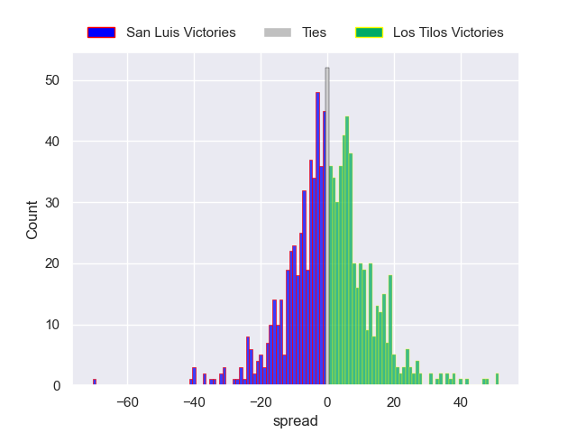

---  
layout: page  
title: San Luis V Los Tilos on 2025/10/04  
date: 2025-10-04  
categories: "URBA Top 13 2025" match projection  
---
# San Luis V Los Tilos on 2025/10/04, 9.0 to 13.0

# Club Level Predictions

Now that the game has been played, lets see how the club predictions did. I predicted Los Tilos to win by 1.16, and Los Tilos won by 4.0. That's an absolute error of 2.8 for the margin of victory, while my average absolute error has been 14.4 over the past six months. This prediction was more accurate than 87.0% of my recent predictions.

For the Over/Under model, I predicted a total of 54.5 and we have an actual total of 22.0. That's an absolute error of 32.5 compared to a six month average of 14.3. This prediction was more accurate than 6.9% of my recent predictions.
## Projected Performances - Club Model

## Projected Spreads - Club Model

## Projected Results - Club Model

