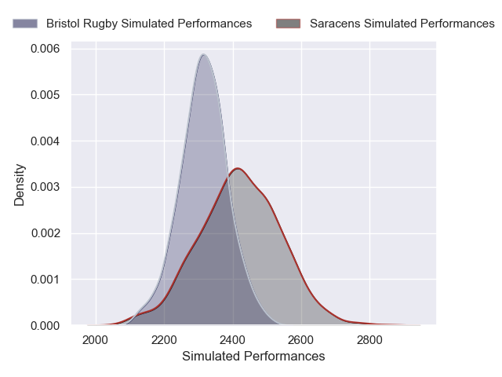
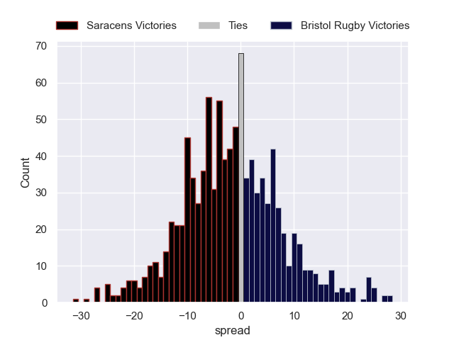

---  
layout: page  
title: Saracens V Bristol Rugby on 2025/10/04  
date: 2025-10-04  
categories: "Gallagher Premiership 25/26" match projection  
---
# Saracens V Bristol Rugby on 2025/10/04, 50.0 to 17.0

# Club Level Predictions

Now that the game has been played, lets see how the club predictions did. I predicted Saracens to win by 1.79, and Saracens won by 33.0. That's an absolute error of 31.2 for the margin of victory, while my average absolute error has been 14.4 over the past six months. This prediction was more accurate than 8.6% of my recent predictions.

For the Over/Under model, I predicted a total of 62.5 and we have an actual total of 67.0. That's an absolute error of 4.5 compared to a six month average of 14.3. This prediction was more accurate than 78.7% of my recent predictions.
## Projected Performances - Club Model

## Projected Spreads - Club Model

## Projected Results - Club Model

