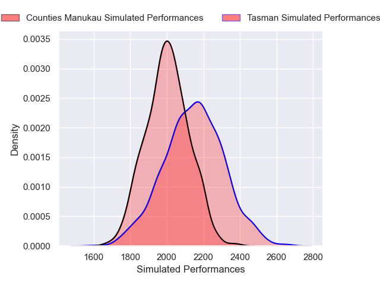
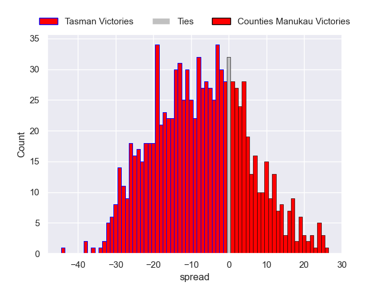

---  
layout: page  
title: Tasman V Counties Manukau on 2025/10/04  
date: 2025-10-04  
categories: "NPC 2025" match projection  
---
# Tasman V Counties Manukau on 2025/10/04, 41.0 to 49.0

# Club Level Predictions

Now that the game has been played, lets see how the club predictions did. I predicted Tasman to win by 3.4, and Counties Manukau won by 8.0. That's an absolute error of 11.4 for the margin of victory, while my average absolute error has been 14.2 over the past six months. This prediction was more accurate than 47.1% of my recent predictions.

For the Over/Under model, I predicted a total of 56.5 and we have an actual total of 90.0. That's an absolute error of 33.5 compared to a six month average of 13.7. This prediction was more accurate than 5.1% of my recent predictions.
## Projected Performances - Club Model

## Projected Spreads - Club Model

## Projected Results - Club Model

