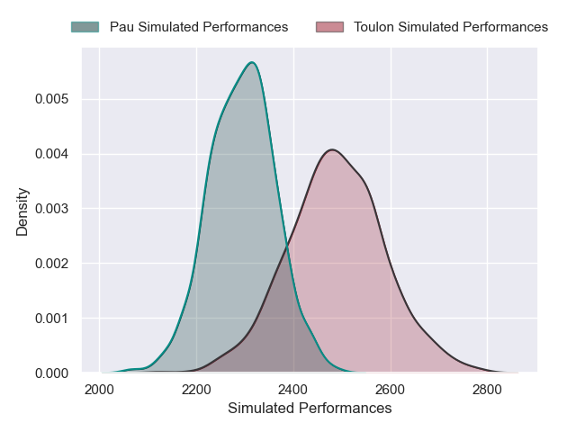
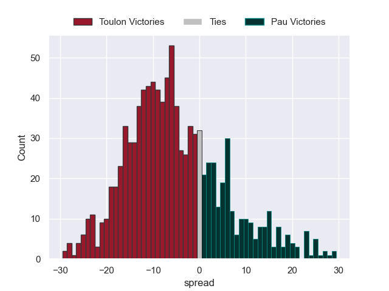

---  
layout: page  
title: Toulon V Pau on 2025/10/04  
date: 2025-10-04  
categories: "Top 14 25/26" match projection  
---
# Toulon V Pau on 2025/10/04, 33.0 to 17.0

# Club Level Predictions

Now that the game has been played, lets see how the club predictions did. I predicted Toulon to win by 3.7, and Toulon won by 16.0. That's an absolute error of 12.3 for the margin of victory, while my average absolute error has been 16.6 over the past six months. This prediction was more accurate than 49.6% of my recent predictions.

For the Over/Under model, I predicted a total of 47.5 and we have an actual total of 50.0. That's an absolute error of 2.5 compared to a six month average of 13.7. This prediction was more accurate than 88.1% of my recent predictions.
## Projected Performances - Club Model

## Projected Spreads - Club Model

## Projected Results - Club Model

