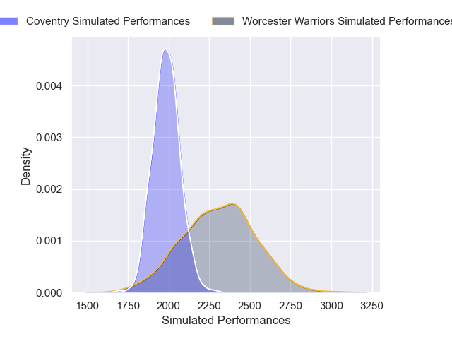
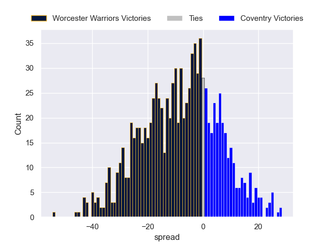

---  
layout: page  
title: Worcester Warriors V Coventry on 2025/10/04  
date: 2025-10-04  
categories: "RFU Championship 25/26" match projection  
---
# Worcester Warriors V Coventry on 2025/10/04, 29.0 to 19.0

# Club Level Predictions

Now that the game has been played, lets see how the club predictions did. I predicted Worcester Warriors to win by 10.66, and Worcester Warriors won by 10.0. That's an absolute error of 0.7 for the margin of victory, while my average absolute error has been 16.6 over the past six months. This prediction was more accurate than 97.8% of my recent predictions.

For the Over/Under model, I predicted a total of 52.5 and we have an actual total of 48.0. That's an absolute error of 4.5 compared to a six month average of 13.7. This prediction was more accurate than 78.5% of my recent predictions.
## Projected Performances - Club Model

## Projected Spreads - Club Model

## Projected Results - Club Model

