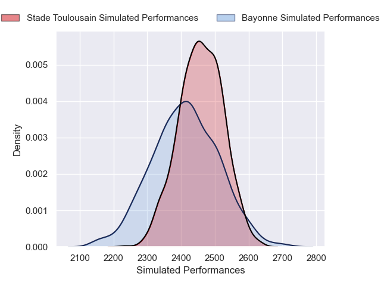
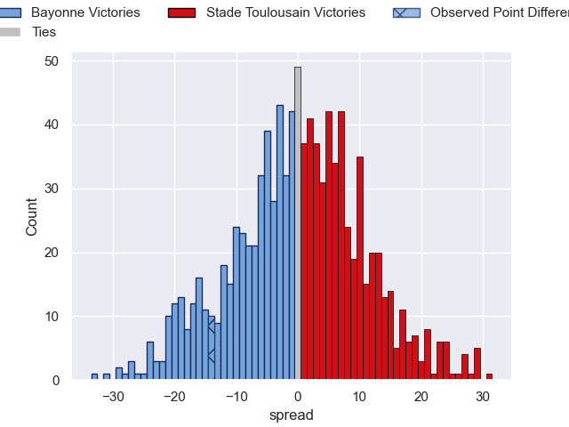
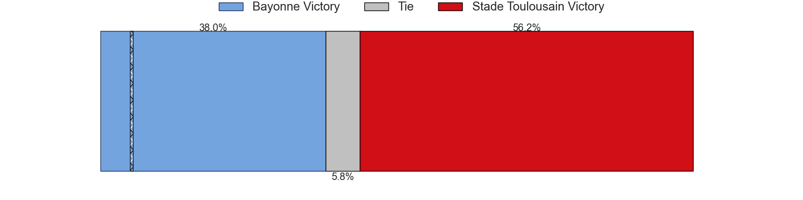

---  
layout: page  
title: Bayonne V Stade Toulousain on 2025/10/05  
date: 2025-10-05  
categories: "Top 14 25/26" match projection  
---
# Bayonne V Stade Toulousain on 2025/10/05, 40.0 to 26.0

# Club Level Predictions

Now that the game has been played, lets see how the club predictions did. I predicted Stade Toulousain to win by 1.18, and Bayonne won by 14.0. That's an absolute error of 15.2 for the margin of victory, while my average absolute error has been 14.4 over the past six months. This prediction was more accurate than 35.7% of my recent predictions.

For the Over/Under model, I predicted a total of 54.5 and we have an actual total of 66.0. That's an absolute error of 11.5 compared to a six month average of 14.3. This prediction was more accurate than 51.8% of my recent predictions.
## Projected Performances - Club Model

## Projected Spreads - Club Model

## Projected Results - Club Model

