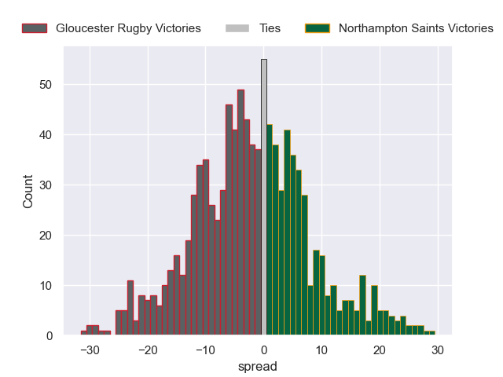

---  
layout: page  
title: Gloucester Rugby V Northampton Saints on 2025/10/05  
date: 2025-10-05  
categories: "Gallagher Premiership 25/26" match projection  
---
# Gloucester Rugby V Northampton Saints on 2025/10/05, 35.0 to 37.0

# Club Level Predictions

Now that the game has been played, lets see how the club predictions did. I predicted Gloucester Rugby to win by 0.66, and Northampton Saints won by 2.0. That's an absolute error of 2.7 for the margin of victory, while my average absolute error has been 14.4 over the past six months. This prediction was more accurate than 88.2% of my recent predictions.

For the Over/Under model, I predicted a total of 63.5 and we have an actual total of 72.0. That's an absolute error of 8.5 compared to a six month average of 14.3. This prediction was more accurate than 62.7% of my recent predictions.
## Projected Performances - Club Model

## Projected Spreads - Club Model

## Projected Results - Club Model

