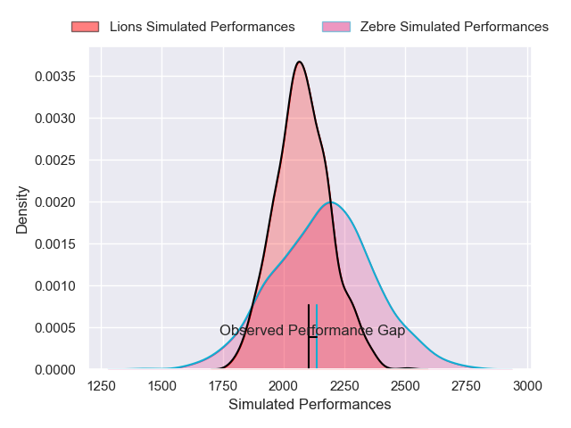
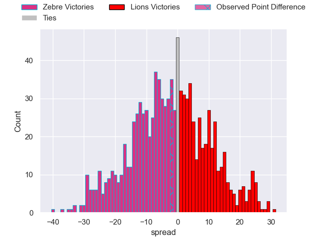

---  
layout: page  
title: Zebre V Lions on 2025/10/05  
date: 2025-10-05  
categories: "United Rugby Championship 25/26" match projection  
---
# Zebre V Lions on 2025/10/05, 22.0 to 20.0

# Club Level Predictions

Now that the game has been played, lets see how the club predictions did. I predicted Zebre to win by 0.02, and Zebre won by 2.0. That's an absolute error of 2.0 for the margin of victory, while my average absolute error has been 14.4 over the past six months. This prediction was more accurate than 90.7% of my recent predictions.

For the Over/Under model, I predicted a total of 61.5 and we have an actual total of 42.0. That's an absolute error of 19.5 compared to a six month average of 14.3. This prediction was more accurate than 26.5% of my recent predictions.
## Projected Performances - Club Model

## Projected Spreads - Club Model

## Projected Results - Club Model

