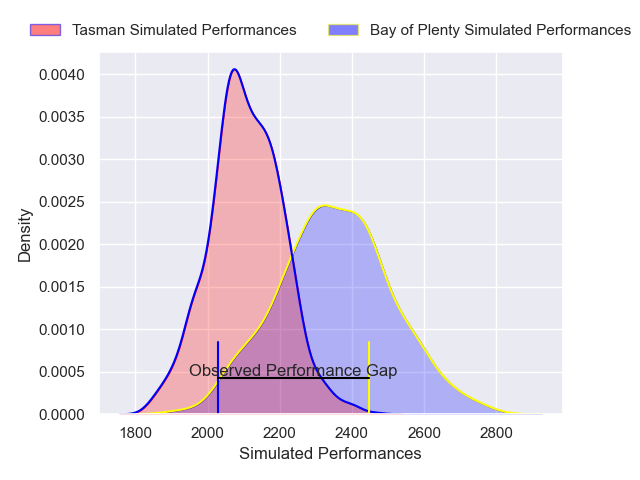
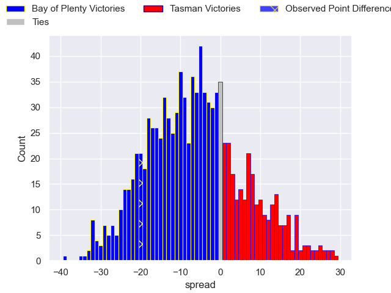

---  
layout: page  
title: Bay of Plenty V Tasman on 2025/10/10  
date: 2025-10-10  
categories: "NPC 2025" match projection  
---
# Bay of Plenty V Tasman on 2025/10/10, 27.0 to 7.0

# Club Level Predictions

Now that the game has been played, lets see how the club predictions did. I predicted Bay of Plenty to win by 6.3, and Bay of Plenty won by 20.0. That's an absolute error of 13.7 for the margin of victory, while my average absolute error has been 14.0 over the past six months. This prediction was more accurate than 38.1% of my recent predictions.

For the Over/Under model, I predicted a total of 58.5 and we have an actual total of 34.0. That's an absolute error of 24.5 compared to a six month average of 13.9. This prediction was more accurate than 15.6% of my recent predictions.
## Projected Performances - Club Model

## Projected Spreads - Club Model

## Projected Results - Club Model

