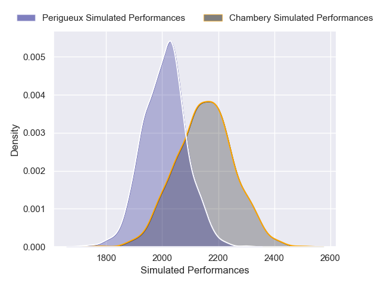
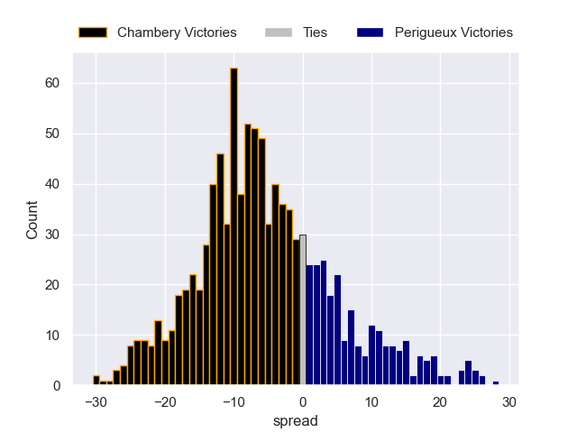

---  
layout: page  
title: Chambery V Périgueux on 2025/10/10  
date: 2025-10-10  
categories: "Nationale 25/26" match projection  
---
# Chambery V Périgueux on 2025/10/10, 35.0 to 14.0

# Club Level Predictions

Now that the game has been played, lets see how the club predictions did. I predicted Chambery to win by 5.11, and Chambery won by 21.0. That's an absolute error of 15.9 for the margin of victory, while my average absolute error has been 14.1 over the past six months. This prediction was more accurate than 32.9% of my recent predictions.

For the Over/Under model, I predicted a total of 41.5 and we have an actual total of 49.0. That's an absolute error of 7.5 compared to a six month average of 13.7. This prediction was more accurate than 66.2% of my recent predictions.
## Projected Performances - Club Model

## Projected Spreads - Club Model

## Projected Results - Club Model

