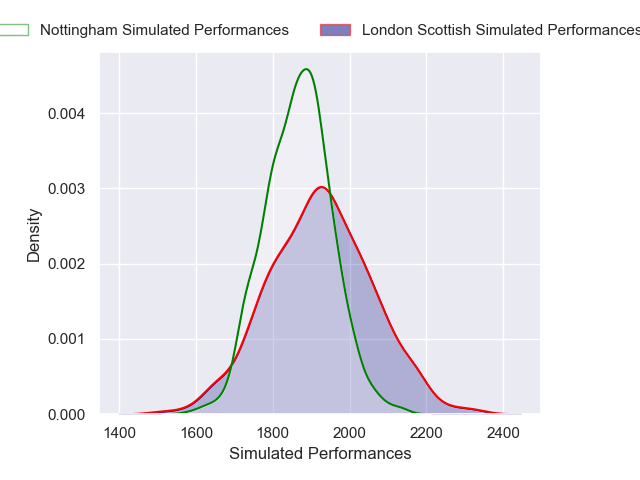
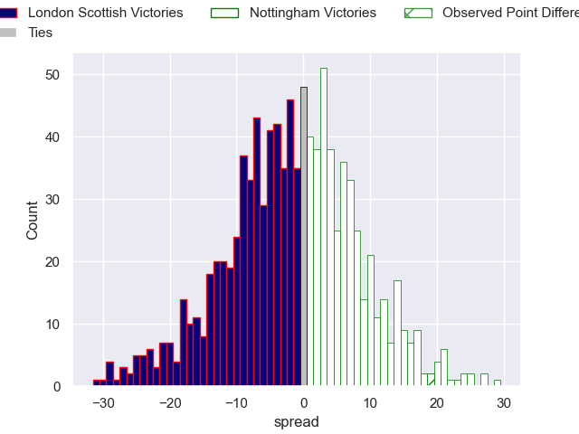

---  
layout: page  
title: London Scottish V Nottingham on 2025/10/10  
date: 2025-10-10  
categories: "RFU Championship 25/26" match projection  
---
# London Scottish V Nottingham on 2025/10/10, 7.0 to 26.0

# Club Level Predictions

Now that the game has been played, lets see how the club predictions did. I predicted London Scottish to win by 1.74, and Nottingham won by 19.0. That's an absolute error of 20.7 for the margin of victory, while my average absolute error has been 14.1 over the past six months. This prediction was more accurate than 21.9% of my recent predictions.

For the Over/Under model, I predicted a total of 56.5 and we have an actual total of 33.0. That's an absolute error of 23.5 compared to a six month average of 13.8. This prediction was more accurate than 16.9% of my recent predictions.
## Projected Performances - Club Model

## Projected Spreads - Club Model

## Projected Results - Club Model

