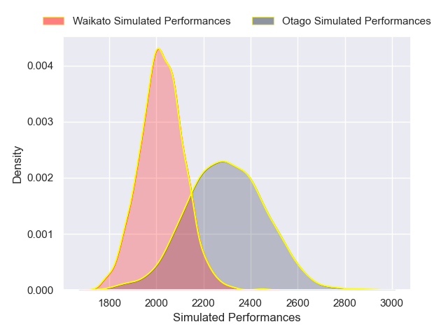
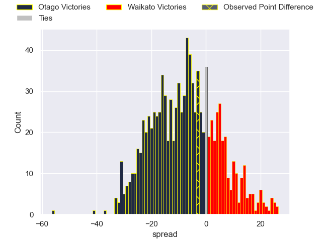

---  
layout: page  
title: Otago V Waikato on 2025/10/10  
date: 2025-10-10  
categories: "NPC 2025" match projection  
---
# Otago V Waikato on 2025/10/10, 44.0 to 41.0

# Club Level Predictions

Now that the game has been played, lets see how the club predictions did. I predicted Otago to win by 7.65, and Otago won by 3.0. That's an absolute error of 4.6 for the margin of victory, while my average absolute error has been 14.0 over the past six months. This prediction was more accurate than 77.2% of my recent predictions.

For the Over/Under model, I predicted a total of 54.5 and we have an actual total of 85.0. That's an absolute error of 30.5 compared to a six month average of 13.9. This prediction was more accurate than 7.0% of my recent predictions.
## Projected Performances - Club Model

## Projected Spreads - Club Model

## Projected Results - Club Model

