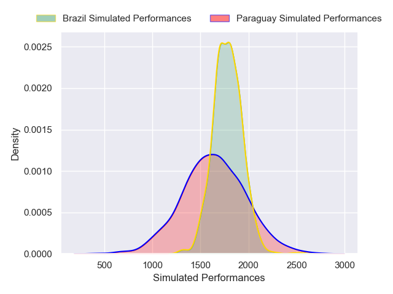
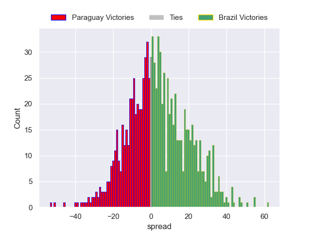

---  
layout: page  
title: Paraguay V Brazil on 2025/10/10  
date: 2025-10-10  
categories: "International Test Match 2025" match projection  
---
# Paraguay V Brazil on 2025/10/10, 39.0 to 19.0

# Club Level Predictions

Now that the game has been played, lets see how the club predictions did. I predicted Brazil to win by 4.46, and Paraguay won by 20.0. That's an absolute error of 24.5 for the margin of victory, while my average absolute error has been 14.1 over the past six months. This prediction was more accurate than 16.2% of my recent predictions.

For the Over/Under model, I predicted a total of 64.5 and we have an actual total of 58.0. That's an absolute error of 6.5 compared to a six month average of 13.7. This prediction was more accurate than 70.6% of my recent predictions.
## Projected Performances - Club Model

## Projected Spreads - Club Model

## Projected Results - Club Model

