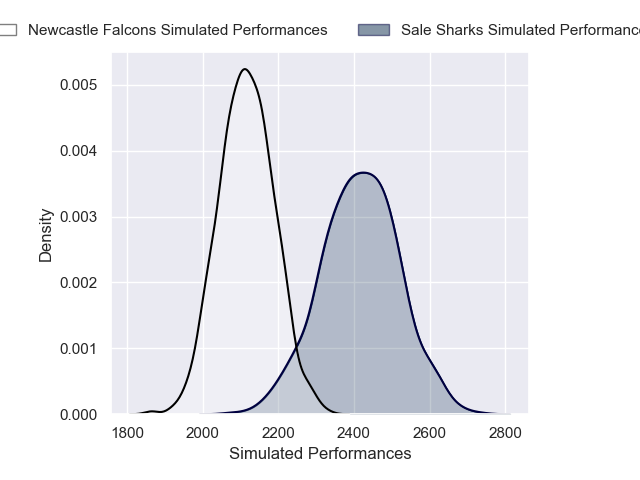
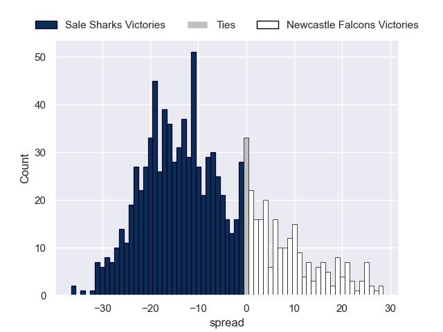

---  
layout: page  
title: Sale Sharks V Newcastle Falcons on 2025/10/10  
date: 2025-10-10  
categories: "Gallagher Premiership 25/26" match projection  
---
# Sale Sharks V Newcastle Falcons on 2025/10/10, 57.0 to 5.0

# Club Level Predictions

Now that the game has been played, lets see how the club predictions did. I predicted Sale Sharks to win by 8.92, and Sale Sharks won by 52.0. That's an absolute error of 43.1 for the margin of victory, while my average absolute error has been 14.1 over the past six months. This prediction was more accurate than 3.3% of my recent predictions.

For the Over/Under model, I predicted a total of 53.5 and we have an actual total of 62.0. That's an absolute error of 8.5 compared to a six month average of 13.7. This prediction was more accurate than 61.0% of my recent predictions.
## Projected Performances - Club Model

## Projected Spreads - Club Model

## Projected Results - Club Model

