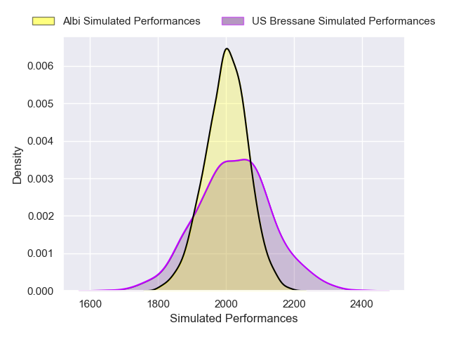
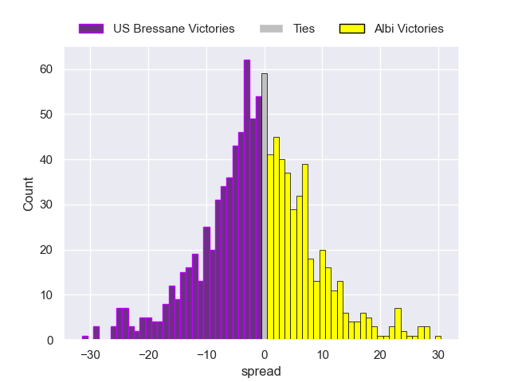

---  
layout: page  
title: US Bressane V Albi on 2025/10/10  
date: 2025-10-10  
categories: "Nationale 25/26" match projection  
---
# US Bressane V Albi on 2025/10/10, 13.0 to 15.0

# Club Level Predictions

Now that the game has been played, lets see how the club predictions did. I predicted US Bressane to win by 0.97, and Albi won by 2.0. That's an absolute error of 3.0 for the margin of victory, while my average absolute error has been 14.0 over the past six months. This prediction was more accurate than 86.4% of my recent predictions.

For the Over/Under model, I predicted a total of 43.5 and we have an actual total of 28.0. That's an absolute error of 15.5 compared to a six month average of 13.9. This prediction was more accurate than 36.0% of my recent predictions.
## Projected Performances - Club Model

## Projected Spreads - Club Model

## Projected Results - Club Model

