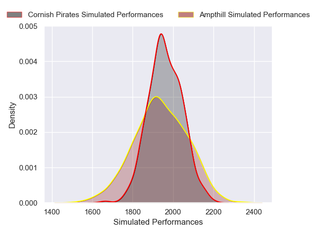
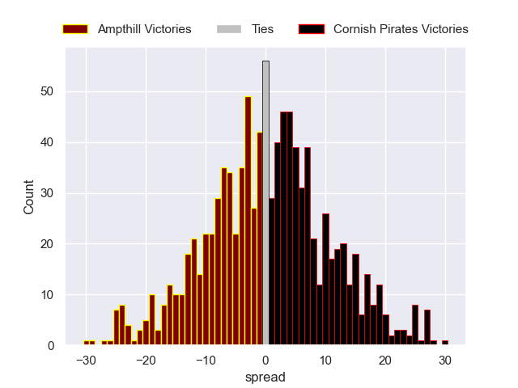

---  
layout: page  
title: Ampthill V Cornish Pirates on 2025/10/11  
date: 2025-10-11  
categories: "RFU Championship 25/26" match projection  
---
# Ampthill V Cornish Pirates on 2025/10/11, 26.0 to 21.0

# Club Level Predictions

Now that the game has been played, lets see how the club predictions did. I predicted Cornish Pirates to win by 0.66, and Ampthill won by 5.0. That's an absolute error of 5.7 for the margin of victory, while my average absolute error has been 14.1 over the past six months. This prediction was more accurate than 72.4% of my recent predictions.

For the Over/Under model, I predicted a total of 56.5 and we have an actual total of 47.0. That's an absolute error of 9.5 compared to a six month average of 13.8. This prediction was more accurate than 57.3% of my recent predictions.
## Projected Performances - Club Model

## Projected Spreads - Club Model

## Projected Results - Club Model

