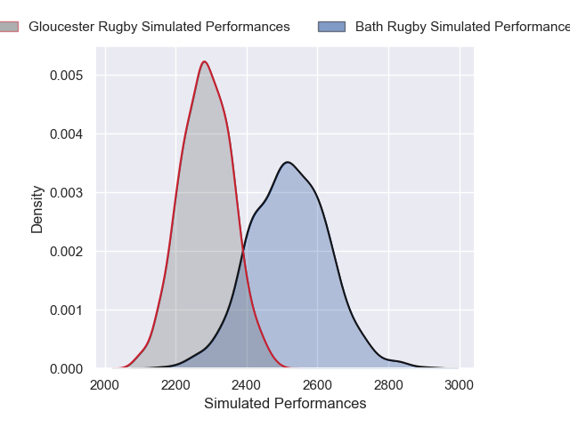
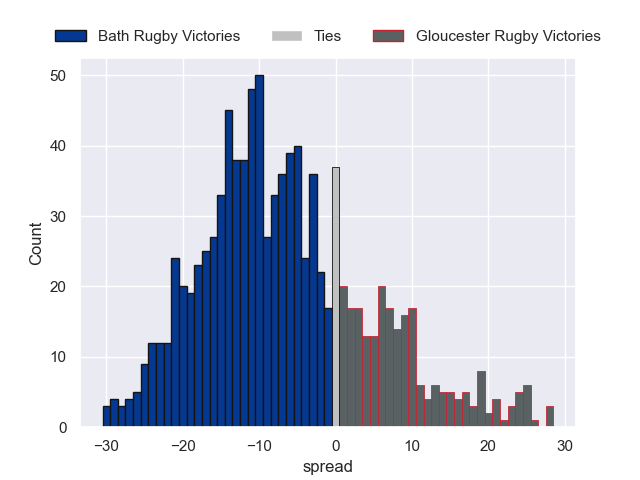

---  
layout: page  
title: Bath Rugby V Gloucester Rugby on 2025/10/11  
date: 2025-10-11  
categories: "Gallagher Premiership 25/26" match projection  
---
# Bath Rugby V Gloucester Rugby on 2025/10/11, 38.0 to 17.0

# Club Level Predictions

Now that the game has been played, lets see how the club predictions did. I predicted Bath Rugby to win by 7.05, and Bath Rugby won by 21.0. That's an absolute error of 14.0 for the margin of victory, while my average absolute error has been 14.1 over the past six months. This prediction was more accurate than 37.4% of my recent predictions.

For the Over/Under model, I predicted a total of 53.5 and we have an actual total of 55.0. That's an absolute error of 1.5 compared to a six month average of 13.7. This prediction was more accurate than 93.3% of my recent predictions.
## Projected Performances - Club Model

## Projected Spreads - Club Model

## Projected Results - Club Model

