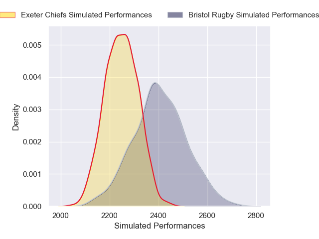
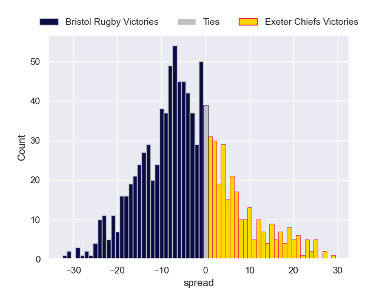

---  
layout: page  
title: Bristol Rugby V Exeter Chiefs on 2025/10/11  
date: 2025-10-11  
categories: "Gallagher Premiership 25/26" match projection  
---
# Bristol Rugby V Exeter Chiefs on 2025/10/11, 18.0 to 14.0

# Club Level Predictions

Now that the game has been played, lets see how the club predictions did. I predicted Bristol Rugby to win by 4.6, and Bristol Rugby won by 4.0. That's an absolute error of 0.6 for the margin of victory, while my average absolute error has been 14.1 over the past six months. This prediction was more accurate than 97.0% of my recent predictions.

For the Over/Under model, I predicted a total of 55.5 and we have an actual total of 32.0. That's an absolute error of 23.5 compared to a six month average of 13.7. This prediction was more accurate than 16.8% of my recent predictions.
## Projected Performances - Club Model

## Projected Spreads - Club Model

## Projected Results - Club Model

