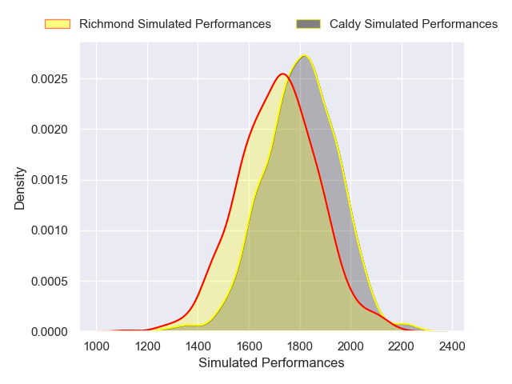
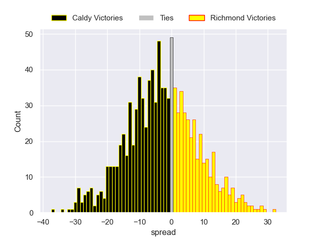

---  
layout: page  
title: Caldy V Richmond on 2025/10/11  
date: 2025-10-11  
categories: "RFU Championship 25/26" match projection  
---
# Caldy V Richmond on 2025/10/11, 27.0 to 21.0

# Club Level Predictions

Now that the game has been played, lets see how the club predictions did. I predicted Caldy to win by 3.2, and Caldy won by 6.0. That's an absolute error of 2.8 for the margin of victory, while my average absolute error has been 14.1 over the past six months. This prediction was more accurate than 87.4% of my recent predictions.

For the Over/Under model, I predicted a total of 49.5 and we have an actual total of 48.0. That's an absolute error of 1.5 compared to a six month average of 13.8. This prediction was more accurate than 92.6% of my recent predictions.
## Projected Performances - Club Model

## Projected Spreads - Club Model

## Projected Results - Club Model

