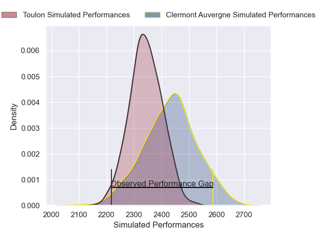
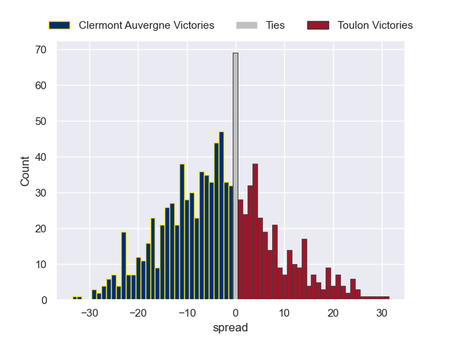

---  
layout: page  
title: Clermont Auvergne V Toulon on 2025/10/11  
date: 2025-10-11  
categories: "Top 14 25/26" match projection  
---
# Clermont Auvergne V Toulon on 2025/10/11, 27.0 to 10.0

# Club Level Predictions

Now that the game has been played, lets see how the club predictions did. I predicted Clermont Auvergne to win by 2.88, and Clermont Auvergne won by 17.0. That's an absolute error of 14.1 for the margin of victory, while my average absolute error has been 14.1 over the past six months. This prediction was more accurate than 37.0% of my recent predictions.

For the Over/Under model, I predicted a total of 51.5 and we have an actual total of 37.0. That's an absolute error of 14.5 compared to a six month average of 13.8. This prediction was more accurate than 38.6% of my recent predictions.
## Projected Performances - Club Model

## Projected Spreads - Club Model

## Projected Results - Club Model

