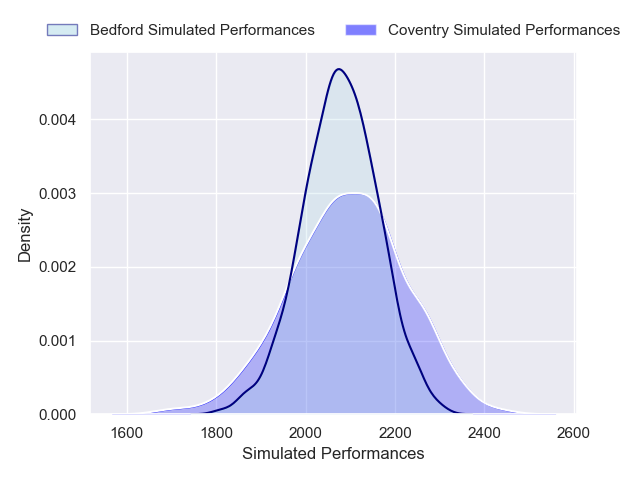
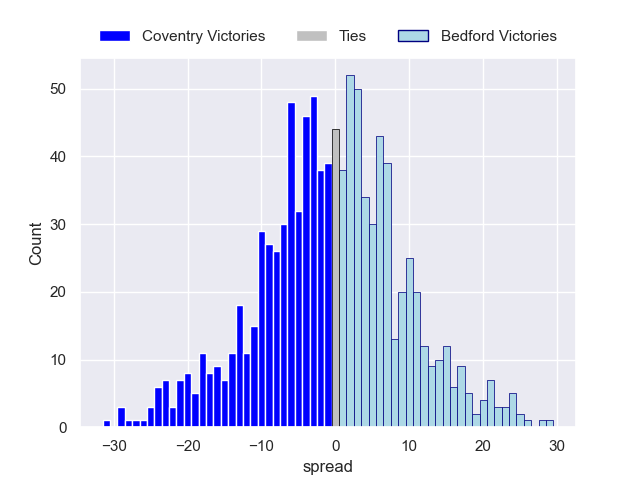

---  
layout: page  
title: Coventry V Bedford on 2025/10/11  
date: 2025-10-11  
categories: "RFU Championship 25/26" match projection  
---
# Coventry V Bedford on 2025/10/11, 35.0 to 30.0

# Club Level Predictions

Now that the game has been played, lets see how the club predictions did. I predicted Coventry to win by 0.76, and Coventry won by 5.0. That's an absolute error of 4.2 for the margin of victory, while my average absolute error has been 14.1 over the past six months. This prediction was more accurate than 79.2% of my recent predictions.

For the Over/Under model, I predicted a total of 61.5 and we have an actual total of 65.0. That's an absolute error of 3.5 compared to a six month average of 13.8. This prediction was more accurate than 84.2% of my recent predictions.
## Projected Performances - Club Model

## Projected Spreads - Club Model

## Projected Results - Club Model

