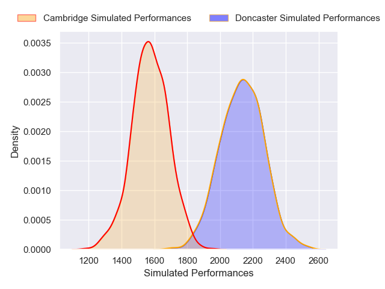
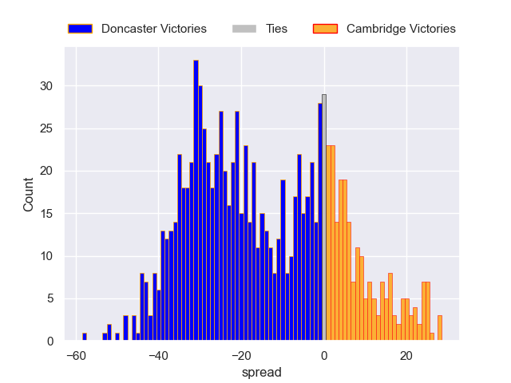

---  
layout: page  
title: Doncaster V Cambridge on 2025/10/11  
date: 2025-10-11  
categories: "RFU Championship 25/26" match projection  
---
# Doncaster V Cambridge on 2025/10/11, 42.0 to 15.0

# Club Level Predictions

Now that the game has been played, lets see how the club predictions did. I predicted Doncaster to win by 14.99, and Doncaster won by 27.0. That's an absolute error of 12.0 for the margin of victory, while my average absolute error has been 14.0 over the past six months. This prediction was more accurate than 45.4% of my recent predictions.

For the Over/Under model, I predicted a total of 77.5 and we have an actual total of 57.0. That's an absolute error of 20.5 compared to a six month average of 13.9. This prediction was more accurate than 22.6% of my recent predictions.
## Projected Performances - Club Model

## Projected Spreads - Club Model

## Projected Results - Club Model

