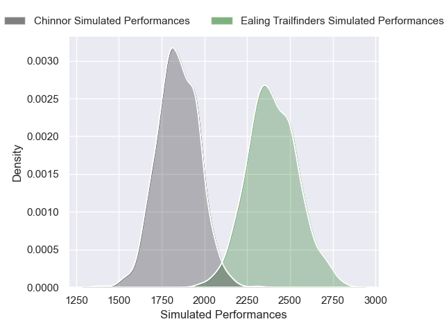
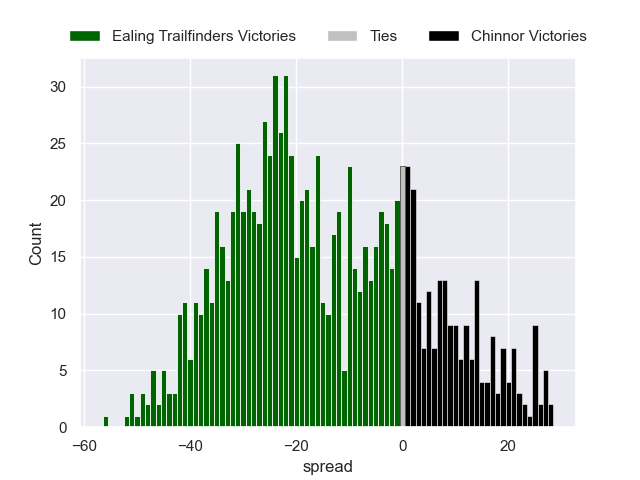

---  
layout: page  
title: Ealing Trailfinders V Chinnor on 2025/10/11  
date: 2025-10-11  
categories: "RFU Championship 25/26" match projection  
---
# Ealing Trailfinders V Chinnor on 2025/10/11, 55.0 to 7.0

# Club Level Predictions

Now that the game has been played, lets see how the club predictions did. I predicted Ealing Trailfinders to win by 13.53, and Ealing Trailfinders won by 48.0. That's an absolute error of 34.5 for the margin of victory, while my average absolute error has been 14.1 over the past six months. This prediction was more accurate than 7.0% of my recent predictions.

For the Over/Under model, I predicted a total of 62.5 and we have an actual total of 62.0. That's an absolute error of 0.5 compared to a six month average of 13.8. This prediction was more accurate than 97.5% of my recent predictions.
## Projected Performances - Club Model

## Projected Spreads - Club Model

## Projected Results - Club Model

