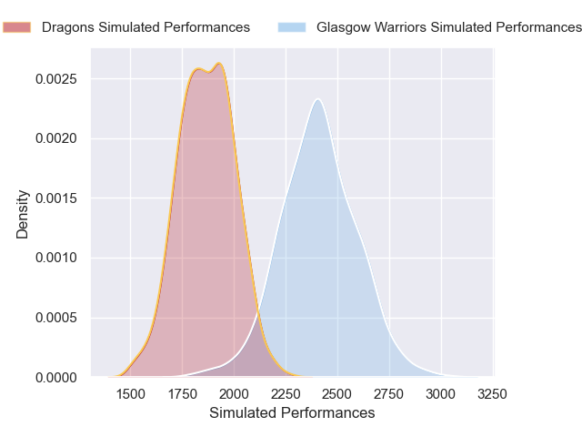
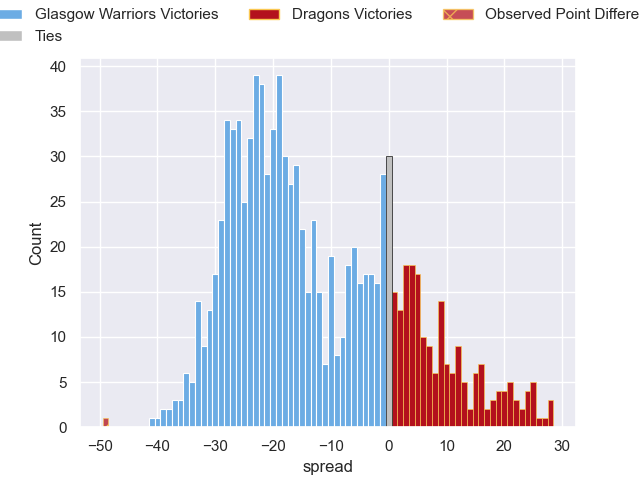

---  
layout: page  
title: Glasgow Warriors V Dragons on 2025/10/11  
date: 2025-10-11  
categories: "United Rugby Championship 25/26" match projection  
---
# Glasgow Warriors V Dragons on 2025/10/11, 49.0 to 0.0

# Club Level Predictions

Now that the game has been played, lets see how the club predictions did. I predicted Glasgow Warriors to win by 11.43, and Glasgow Warriors won by 49.0. That's an absolute error of 37.6 for the margin of victory, while my average absolute error has been 14.0 over the past six months. This prediction was more accurate than 5.4% of my recent predictions.

For the Over/Under model, I predicted a total of 51.5 and we have an actual total of 49.0. That's an absolute error of 2.5 compared to a six month average of 13.9. This prediction was more accurate than 89.4% of my recent predictions.
## Projected Performances - Club Model

## Projected Spreads - Club Model

## Projected Results - Club Model

