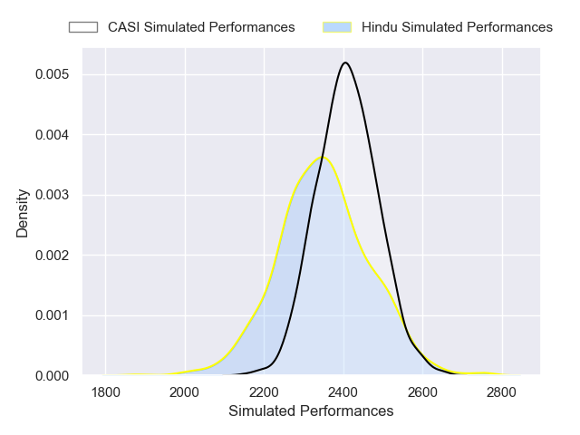
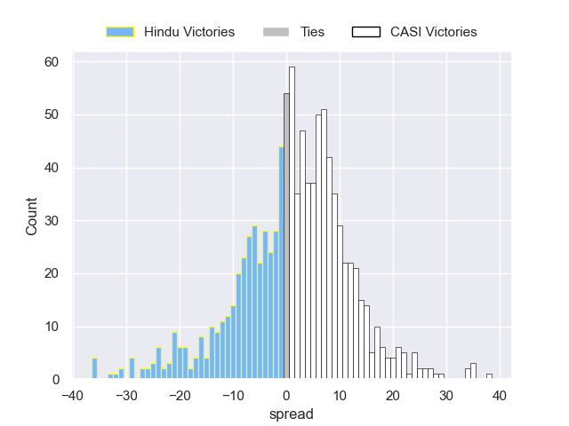

---  
layout: page  
title: Hindu V CASI on 2025/10/11  
date: 2025-10-11  
categories: "URBA Top 13 2025" match projection  
---
# Hindu V CASI on 2025/10/11, 46.0 to 7.0

# Club Level Predictions

Now that the game has been played, lets see how the club predictions did. I predicted CASI to win by 1.53, and Hindu won by 39.0. That's an absolute error of 40.5 for the margin of victory, while my average absolute error has been 14.1 over the past six months. This prediction was more accurate than 4.3% of my recent predictions.

For the Over/Under model, I predicted a total of 51.5 and we have an actual total of 53.0. That's an absolute error of 1.5 compared to a six month average of 13.7. This prediction was more accurate than 93.3% of my recent predictions.
## Projected Performances - Club Model

## Projected Spreads - Club Model

## Projected Results - Club Model

